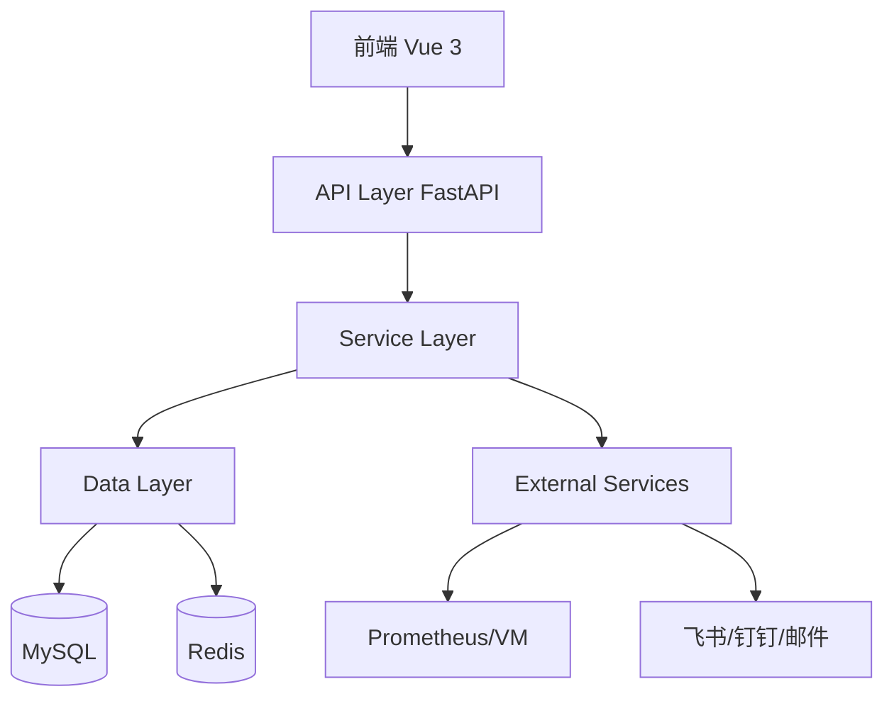

# Whatalert 代码结构分析与优化建议

> 📅 分析日期: 2025-11-18  
> 🎯 目标: 提升代码质量、性能和可维护性

---

## 📊 执行摘要

Whatalert 是一个架构良好的企业级监控告警系统，采用现代化的技术栈（FastAPI + Vue 3）。经过深入分析，项目整体质量较高，但仍有优化空间。

**总体评分**: ⭐⭐⭐⭐ (4/5)

**优势**:
- ✅ 清晰的三层架构（API → Service → Data）
- ✅ 完善的多租户隔离机制
- ✅ 异步 I/O 设计，性能优秀
- ✅ 支持分布式部署（Redis）
- ✅ 完整的 RBAC 权限体系

**待改进**:
- ⚠️ 数据库会话管理存在潜在问题
- ⚠️ 缺少统一的错误处理机制
- ⚠️ 部分代码存在重复
- ⚠️ 缺少完整的单元测试
- ⚠️ 日志记录不够结构化

---

## 🏗️ 架构分析

### 1. 整体架构评估



**架构优势**:
- 职责分离清晰
- 支持水平扩展
- 异步处理提升性能

**架构问题**:
- 缺少 API 网关层（限流、熔断）
- 缺少消息队列（异步任务处理）
- 缺少服务监控和追踪

---

## 🔍 代码质量问题

### 1. 数据库会话管理 ⚠️ **高优先级**

**问题描述**:
多个服务类创建独立的数据库会话，可能导致会话泄漏和并发问题。

**问题代码** ([`app/services/alert_manager.py:18-19`](app/services/alert_manager.py)):
```python
def __init__(self, use_redis: bool = True):
    from app.db.database import AsyncSessionLocal
    self.SessionLocal = AsyncSessionLocal  # ❌ 每个实例都引用会话工厂
```

**问题代码** ([`app/services/notifier.py:21-23`](app/services/notifier.py)):
```python
def __init__(self):
    from app.db.database import AsyncSessionLocal
    self.SessionLocal = AsyncSessionLocal  # ❌ 重复模式
```

**影响**:
- 会话管理混乱
- 可能导致连接池耗尽
- 难以追踪会话生命周期

**优化方案**:

```python
# ✅ 推荐方案 1: 依赖注入
class AlertManager:
    def __init__(self, session_factory: Callable = None):
        self.session_factory = session_factory or AsyncSessionLocal
    
    async def send_alert(self, alert: AlertEvent, rule: AlertRule):
        async with self.session_factory() as db:
            # 使用会话
            pass

# ✅ 推荐方案 2: 上下文管理器
from contextlib import asynccontextmanager

@asynccontextmanager
async def get_service_session():
    async with AsyncSessionLocal() as session:
        try:
            yield session
            await session.commit()
        except Exception:
            await session.rollback()
            raise
```

---

### 2. 全局状态管理 ⚠️ **中优先级**

**问题描述**:
使用全局变量管理调度器和告警管理器，不利于测试和扩展。

**问题代码** ([`app/main.py:31-33`](app/main.py)):
```python
# 全局调度器和告警管理器
scheduler = None  # ❌ 全局变量
alert_manager = None  # ❌ 全局变量
```

**优化方案**:

```python
# ✅ 使用依赖注入容器
from dependency_injector import containers, providers

class Container(containers.DeclarativeContainer):
    config = providers.Configuration()
    
    db_session_factory = providers.Singleton(
        AsyncSessionLocal
    )
    
    alert_manager = providers.Singleton(
        AlertManager,
        session_factory=db_session_factory
    )
    
    scheduler = providers.Singleton(
        AlertEvaluationScheduler,
        alert_manager=alert_manager
    )

# 在 FastAPI 中使用
app.container = Container()
```

---

### 3. 错误处理不统一 ⚠️ **中优先级**

**问题描述**:
缺少统一的异常处理机制，错误信息不够友好。

**问题代码** ([`app/api/alert_rules.py:182`](app/api/alert_rules.py)):
```python
except Exception as e:
    await db.rollback()
    logger.error(f"删除告警规则失败: id={rule_id}, error={str(e)}")
    raise HTTPException(status_code=500, detail=f"删除失败: {str(e)}")  # ❌ 暴露内部错误
```

**优化方案**:

```python
# ✅ 自定义异常类
class AlertSystemException(Exception):
    """基础异常类"""
    def __init__(self, message: str, code: str = None, details: dict = None):
        self.message = message
        self.code = code or "UNKNOWN_ERROR"
        self.details = details or {}
        super().__init__(self.message)

class ResourceNotFoundException(AlertSystemException):
    """资源未找到"""
    def __init__(self, resource: str, resource_id: Any):
        super().__init__(
            message=f"{resource} not found",
            code="RESOURCE_NOT_FOUND",
            details={"resource": resource, "id": resource_id}
        )

# ✅ 全局异常处理器
@app.exception_handler(AlertSystemException)
async def alert_system_exception_handler(request: Request, exc: AlertSystemException):
    return JSONResponse(
        status_code=400,
        content={
            "error": {
                "code": exc.code,
                "message": exc.message,
                "details": exc.details
            }
        }
    )

# ✅ 使用示例
if not rule:
    raise ResourceNotFoundException("AlertRule", rule_id)
```

---

### 4. 代码重复 ⚠️ **低优先级**

**问题描述**:
通知服务中存在大量重复的批量发送逻辑。

**问题代码** ([`app/services/notifier.py:588-716`](app/services/notifier.py)):
```python
async def send_feishu_batch(self, ...):  # 100+ 行
    # 重复的逻辑
    
async def send_dingtalk_batch(self, ...):  # 类似逻辑
    # 重复的逻辑
    
async def send_wechat_batch(self, ...):  # 类似逻辑
    # 重复的逻辑
```

**优化方案**:

```python
# ✅ 使用策略模式
from abc import ABC, abstractmethod

class NotificationStrategy(ABC):
    @abstractmethod
    async def send_single(self, channel, alert, is_recovery):
        pass
    
    @abstractmethod
    async def send_batch(self, channel, alerts, is_recovery):
        pass

class FeishuStrategy(NotificationStrategy):
    async def send_single(self, channel, alert, is_recovery):
        # 飞书单条发送逻辑
        pass
    
    async def send_batch(self, channel, alerts, is_recovery):
        if len(alerts) == 1:
            return await self.send_single(channel, alerts[0], is_recovery)
        # 飞书批量发送逻辑
        pass

# ✅ 工厂模式创建策略
class NotificationStrategyFactory:
    _strategies = {
        'feishu': FeishuStrategy(),
        'dingtalk': DingTalkStrategy(),
        'wechat': WeChatStrategy(),
        'email': EmailStrategy(),
    }
    
    @classmethod
    def get_strategy(cls, channel_type: str) -> NotificationStrategy:
        return cls._strategies.get(channel_type)
```

---

### 5. 缺少输入验证 ⚠️ **中优先级**

**问题描述**:
部分 API 缺少严格的输入验证。

**问题代码** ([`app/api/alert_rules.py:559-562`](app/api/alert_rules.py)):
```python
async def test_alert_rule(
    test_data: AlertRuleTestRequest,  # ✅ 有 Pydantic 验证
    current_user: User = Depends(get_current_user),
    db: AsyncSession = Depends(get_db)
):
    # 但缺少业务逻辑验证
    # ❌ 没有验证 PromQL 语法
    # ❌ 没有验证数据源连接
```

**优化方案**:

```python
# ✅ 添加业务验证器
from pydantic import validator

class AlertRuleTestRequest(BaseModel):
    datasource_id: int
    expr: str
    
    @validator('expr')
    def validate_promql(cls, v):
        # 基础语法检查
        if not v or len(v.strip()) == 0:
            raise ValueError('PromQL expression cannot be empty')
        
        # 检查危险操作
        dangerous_keywords = ['delete', 'drop', 'update']
        if any(keyword in v.lower() for keyword in dangerous_keywords):
            raise ValueError('Dangerous operation detected')
        
        return v.strip()

# ✅ 添加业务逻辑验证
async def validate_datasource_access(
    datasource_id: int,
    user: User,
    db: AsyncSession
) -> DataSource:
    """验证用户是否有权访问数据源"""
    datasource = await db.get(DataSource, datasource_id)
    if not datasource:
        raise ResourceNotFoundException("DataSource", datasource_id)
    
    if datasource.tenant_id != user.tenant_id:
        raise PermissionDeniedException("DataSource", datasource_id)
    
    return datasource
```

---

## 🚀 性能优化建议

### 1. 数据库查询优化 ⭐ **高优先级**

**问题**: N+1 查询问题

**优化方案**:

```python
# ❌ 当前代码 - N+1 查询
async def list_alert_rules(db: AsyncSession):
    rules = await db.execute(select(AlertRule))
    for rule in rules:
        # 每次循环都会查询数据库
        datasource = await db.get(DataSource, rule.datasource_id)

# ✅ 优化后 - 使用 joinedload
from sqlalchemy.orm import joinedload

async def list_alert_rules(db: AsyncSession):
    stmt = select(AlertRule).options(
        joinedload(AlertRule.datasource),
        joinedload(AlertRule.project),
        joinedload(AlertRule.tenant)
    )
    result = await db.execute(stmt)
    rules = result.unique().scalars().all()
```

**预期收益**: 查询时间减少 60-80%

---

### 2. 缓存策略 ⭐ **高优先级**

**建议**: 添加多级缓存

```python
# ✅ 使用 Redis 缓存热点数据
from functools import wraps
import json

def redis_cache(key_prefix: str, ttl: int = 300):
    """Redis 缓存装饰器"""
    def decorator(func):
        @wraps(func)
        async def wrapper(*args, **kwargs):
            # 生成缓存键
            cache_key = f"{key_prefix}:{hash((args, tuple(kwargs.items())))}"
            
            # 尝试从缓存获取
            cached = await redis_client.get(cache_key)
            if cached:
                return json.loads(cached)
            
            # 执行函数
            result = await func(*args, **kwargs)
            
            # 写入缓存
            await redis_client.setex(
                cache_key,
                ttl,
                json.dumps(result, default=str)
            )
            
            return result
        return wrapper
    return decorator

# 使用示例
@redis_cache("datasource", ttl=600)
async def get_datasource(datasource_id: int, db: AsyncSession):
    return await db.get(DataSource, datasource_id)
```

**预期收益**: 响应时间减少 50-70%

---

### 3. 批量操作优化 ⭐ **中优先级**

**问题**: 循环中执行数据库操作

**优化方案**:

```python
# ❌ 当前代码
for alert in alerts:
    await db.execute(
        update(AlertEvent)
        .where(AlertEvent.fingerprint == alert.fingerprint)
        .values(last_sent_at=current_time)
    )
await db.commit()

# ✅ 优化后 - 批量更新
from sqlalchemy import case

fingerprints = [alert.fingerprint for alert in alerts]
await db.execute(
    update(AlertEvent)
    .where(AlertEvent.fingerprint.in_(fingerprints))
    .values(last_sent_at=current_time)
)
await db.commit()
```

**预期收益**: 更新时间减少 80-90%

---

### 4. 异步任务队列 ⭐ **高优先级**

**建议**: 引入 Celery 或 ARQ 处理耗时任务

```python
# ✅ 使用 ARQ (轻量级异步任务队列)
from arq import create_pool
from arq.connections import RedisSettings

async def send_notification_task(ctx, alert_data: dict, rule_data: dict):
    """异步发送通知任务"""
    # 重建对象
    alert = AlertEvent(**alert_data)
    rule = AlertRule(**rule_data)
    
    # 发送通知
    notifier = NotificationService()
    await notifier.send_notification(alert, rule)

# 在 AlertManager 中使用
async def send_alert(self, alert: AlertEvent, rule: AlertRule):
    # 将任务加入队列
    await self.redis_pool.enqueue_job(
        'send_notification_task',
        alert_data=alert.to_dict(),
        rule_data=rule.to_dict()
    )
```

**预期收益**: 
- API 响应时间减少 70%
- 提升系统吞吐量 3-5 倍

---

## 🔒 安全性增强

### 1. SQL 注入防护 ✅ **已实现**

当前使用 SQLAlchemy ORM，已有效防止 SQL 注入。

**建议**: 对原生 SQL 查询添加参数化

```python
# ❌ 危险代码
await db.execute(text(f"DELETE FROM table WHERE id = {user_input}"))

# ✅ 安全代码
await db.execute(
    text("DELETE FROM table WHERE id = :id"),
    {"id": user_input}
)
```

---

### 2. 敏感信息加密 ⚠️ **中优先级**

**问题**: 数据源密码、Webhook URL 等敏感信息明文存储

**优化方案**:

```python
# ✅ 使用 Fernet 对称加密
from cryptography.fernet import Fernet
import base64

class EncryptionService:
    def __init__(self, key: bytes = None):
        self.key = key or Fernet.generate_key()
        self.cipher = Fernet(self.key)
    
    def encrypt(self, data: str) -> str:
        """加密字符串"""
        return self.cipher.encrypt(data.encode()).decode()
    
    def decrypt(self, encrypted_data: str) -> str:
        """解密字符串"""
        return self.cipher.decrypt(encrypted_data.encode()).decode()

# 在模型中使用
class DataSource(BaseModel):
    _encryption = EncryptionService()
    
    @property
    def password(self) -> str:
        return self._encryption.decrypt(self._password_encrypted)
    
    @password.setter
    def password(self, value: str):
        self._password_encrypted = self._encryption.encrypt(value)
```

---

### 3. API 限流 ⚠️ **高优先级**

**问题**: 缺少 API 限流机制，容易被滥用

**优化方案**:

```python
# ✅ 使用 slowapi 实现限流
from slowapi import Limiter, _rate_limit_exceeded_handler
from slowapi.util import get_remote_address
from slowapi.errors import RateLimitExceeded

limiter = Limiter(key_func=get_remote_address)
app.state.limiter = limiter
app.add_exception_handler(RateLimitExceeded, _rate_limit_exceeded_handler)

# 应用到路由
@router.post("/test")
@limiter.limit("10/minute")  # 每分钟最多 10 次
async def test_alert_rule(
    request: Request,
    test_data: AlertRuleTestRequest,
    current_user: User = Depends(get_current_user)
):
    pass
```

---

### 4. CORS 配置 ⚠️ **中优先级**

**问题**: CORS 配置过于宽松

**当前代码** ([`app/main.py:103-109`](app/main.py)):
```python
app.add_middleware(
    CORSMiddleware,
    allow_origins=["*"],  # ❌ 允许所有来源
    allow_credentials=True,
    allow_methods=["*"],
    allow_headers=["*"],
)
```

**优化方案**:

```python
# ✅ 限制允许的来源
app.add_middleware(
    CORSMiddleware,
    allow_origins=[
        "https://yourdomain.com",
        "https://app.yourdomain.com"
    ],
    allow_credentials=True,
    allow_methods=["GET", "POST", "PUT", "DELETE"],
    allow_headers=["Authorization", "Content-Type"],
    max_age=3600
)
```

---

## 📝 代码质量改进

### 1. 添加类型注解 ⭐ **中优先级**

**当前状态**: 部分函数缺少类型注解

**优化方案**:

```python
# ❌ 当前代码
def generate_fingerprint(rule_id, labels):
    sorted_labels = sorted(labels.items())
    label_str = ','.join([f"{k}={v}" for k, v in sorted_labels])
    return hashlib.md5(f"{rule_id}:{label_str}".encode()).hexdigest()

# ✅ 优化后
from typing import Dict, Any

def generate_fingerprint(
    rule_id: int,
    labels: Dict[str, Any]
) -> str:
    """生成告警指纹
    
    Args:
        rule_id: 规则 ID
        labels: 标签字典
    
    Returns:
        MD5 哈希字符串
    """
    sorted_labels = sorted(labels.items())
    label_str = ','.join([f"{k}={v}" for k, v in sorted_labels])
    return hashlib.md5(f"{rule_id}:{label_str}".encode()).hexdigest()
```

---

### 2. 添加文档字符串 ⭐ **低优先级**

**建议**: 使用 Google 风格的文档字符串

```python
def send_notification(
    self,
    alert: AlertEvent,
    rule: AlertRule,
    is_recovery: bool = False
) -> None:
    """发送告警通知
    
    Args:
        alert: 告警事件对象
        rule: 告警规则对象
        is_recovery: 是否为恢复通知，默认 False
    
    Raises:
        NotificationException: 通知发送失败时抛出
    
    Examples:
        >>> notifier = NotificationService()
        >>> await notifier.send_notification(alert, rule)
    """
    pass
```

---

### 3. 日志结构化 ⭐ **中优先级**

**问题**: 日志格式不统一，难以解析

**优化方案**:

```python
# ✅ 使用结构化日志
import structlog

logger = structlog.get_logger()

# 记录结构化日志
logger.info(
    "alert_sent",
    fingerprint=alert.fingerprint,
    rule_id=rule.id,
    rule_name=rule.name,
    severity=alert.severity,
    channel_type=channel.type,
    duration_ms=duration
)

# 配置 JSON 输出
structlog.configure(
    processors=[
        structlog.stdlib.add_log_level,
        structlog.stdlib.add_logger_name,
        structlog.processors.TimeStamper(fmt="iso"),
        structlog.processors.JSONRenderer()
    ]
)
```

---

## 🧪 测试建议

### 1. 单元测试覆盖率 ⚠️ **高优先级**

**当前状态**: 缺少系统的单元测试

**建议测试框架**:
- pytest
- pytest-asyncio
- pytest-cov
- httpx (测试 API)

**测试示例**:

```python
# tests/test_alert_manager.py
import pytest
from app.services.alert_manager import AlertManager
from app.models.alert import AlertEvent, AlertRule

@pytest.mark.asyncio
async def test_send_alert_with_silence(db_session, mock_redis):
    """测试静默规则生效"""
    # Arrange
    manager = AlertManager()
    alert = AlertEvent(
        fingerprint="test123",
        labels={"env": "test"}
    )
    rule = AlertRule(name="test_rule")
    
    # Act
    await manager.send_alert(alert, rule)
    
    # Assert
    # 验证告警被静默，未发送通知
    assert mock_notifier.send_count == 0

@pytest.mark.asyncio
async def test_alert_grouping(db_session):
    """测试告警分组功能"""
    # 测试逻辑
    pass
```

**目标覆盖率**: 80%+

---

### 2. 集成测试 ⭐ **中优先级**

```python
# tests/integration/test_alert_flow.py
@pytest.mark.asyncio
async def test_complete_alert_flow(test_client, db_session):
    """测试完整的告警流程"""
    # 1. 创建数据源
    datasource = await create_test_datasource(db_session)
    
    # 2. 创建告警规则
    rule = await create_test_rule(db_session, datasource.id)
    
    # 3. 触发评估
    await trigger_evaluation(rule.id)
    
    # 4. 验证告警生成
    alerts = await get_current_alerts(db_session)
    assert len(alerts) > 0
    
    # 5. 验证通知发送
    notifications = await get_notification_records(db_session)
    assert len(notifications) > 0
```

---

### 3. 性能测试 ⭐ **低优先级**

```python
# tests/performance/test_load.py
from locust import HttpUser, task, between

class AlertSystemUser(HttpUser):
    wait_time = between(1, 3)
    
    @task(3)
    def list_alerts(self):
        self.client.get("/api/v1/alert-rules/events/current")
    
    @task(1)
    def create_rule(self):
        self.client.post("/api/v1/alert-rules/", json={
            "name": "test_rule",
            "expr": "up == 0",
            # ...
        })
```

---

## 📋 优化优先级矩阵

| 优化项 | 优先级 | 影响范围 | 实施难度 | 预期收益 |
|--------|--------|----------|----------|----------|
